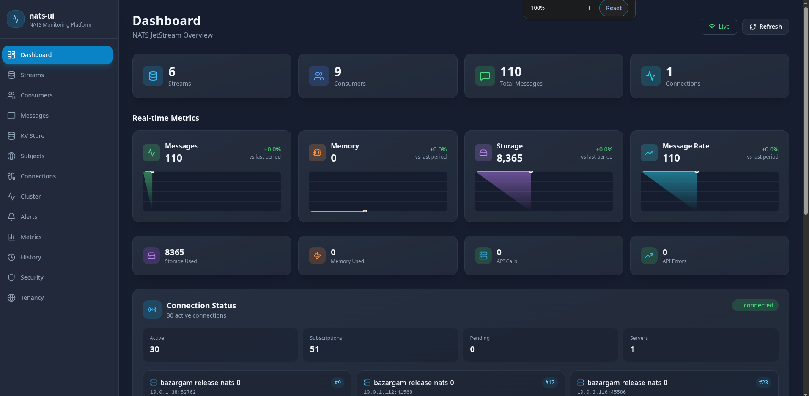
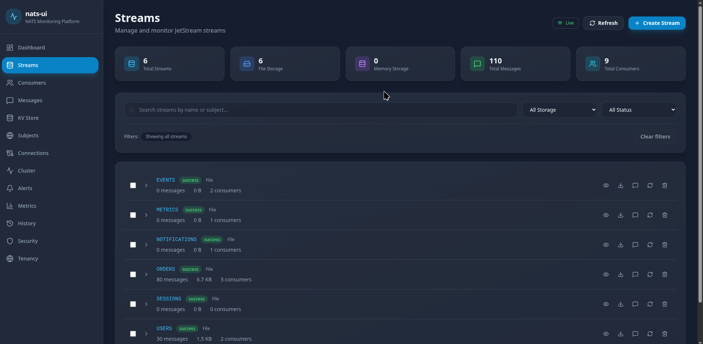

<div align="center">

# nats-horizon

### 🔵 Modern NATS Monitoring & Management Platform

[](LICENSE)
[](https://go.dev)
[](https://wails.io)
[](https://reactjs.org)
[](https://vitejs.dev)
[](https://www.typescriptlang.org)
[](Dockerfile)
[]()
[](https://github.com/amir-baghshahy/nats-horizon)

A comprehensive, open-source monitoring and management platform for NATS JetStream infrastructure.

**🌍 6 Languages | 🖥️ Native Desktop | 🔌 Zero Dependencies | 📦 Single Binary**



---

| [🚀 Quick Start](#-quick-start) | [📦 Installation](#-installation) | [📊 Features](#-features) | [🖼️ Screenshots](#️-screenshots) | [⚖️ Compare](#️-vs-others) | [🏗️ Architecture](#️-architecture) |

</div>

---

## What is nats-horizon?

NATS is fast. NATS scales well. But managing a production NATS JetStream cluster shouldn't require memorizing CLI flags or running five infrastructure services just to see what's happening.

**nats-horizon** is a **native desktop application** that gives you full observability and control over your NATS JetStream infrastructure:

- **See everything** — Real-time dashboard with live metrics for streams, consumers, KV stores, and cluster health
- **Control everything** — Create, edit, delete, replay, and pause consumers directly from the UI
- **Debug everything** — Message inspector, header viewer, JSON formatter, subject explorer, and audit logs
- **Alert on everything** — Get notified when consumer lag spikes, storage fills up, or any threshold is breached
- **Deploy anywhere** — Native desktop app for Windows, macOS, and Linux. Single binary, zero dependencies.
- **Zero config** — No `.env` files, no complex setup. Just run and configure via the built-in wizard.

### Why we built this

We run NATS JetStream in production. We tried every existing tool and hit the same wall:

- **nats-console** — Powerful, but needs 5 services (PostgreSQL, ClickHouse, Redis, Fastify, Next.js). Overkill for most teams.
- **nats-nui** — Fast and popular, but it's a *browser*, not a *command center*. No alerts, no audit, no history.
- **nats-dashboard** — Beautiful, but read-only. You can watch, but you can't act.

So we built **nats-horizon** — a native desktop app that fits in a single binary with no external dependencies.

---


## 🚀 Quick Start

### Option 1: Run Desktop App ⭐ (Recommended)

Build and run the native desktop application:

```bash
# Clone the repository
git clone https://github.com/amir-baghshahy/nats-horizon.git
cd nats-horizon

# Install dependencies
make install

# Run in development mode (with hot reload)
make dev

# Or build for production
make build
```

The desktop app will open as a native window. No browser needed!

### Option 2: Download Pre-built Binary

Download a pre-built binary for your platform from the [Releases](https://github.com/amir-baghshahy/nats-horizon/releases) page:

- **Windows**: `nats-horizon-windows-amd64.exe`
- **macOS**: `nats-horizon-darwin-amd64` (or `darwin-arm64` for Apple Silicon)
- **Linux**: `nats-horizon-linux-amd64`

### Option 3: Docker Compose (Web Mode)

Zero local dependencies. Starts nats-horizon **and** a JetStream-enabled NATS server automatically.

```bash
git clone https://github.com/amir-baghshahy/nats-horizon.git
cd nats-horizon
docker compose up
```

Open **http://localhost:3000**. Done.

---


## 📦 Installation

### Desktop App (Wails v2)

| Platform | Command |
|----------|---------|
| **Development** | `make dev` |
| **Build** | `make build` |
| **Run** | `./build/nats-horizon` |

#### Requirements

- **Go 1.25+**
- **Node.js 18+** (for frontend build)
- **Wails CLI**: `go install github.com/wailsapp/wails/v2/cmd/wails@latest`

#### Platform-specific dependencies

**Linux:**
```bash
# Debian/Ubuntu
sudo apt install libgtk-3-dev libwebkit2gtk-4.0-dev

# Fedora
sudo dnf install gtk3-devel webkit2gtk3-devel
```

**macOS:**
- Xcode Command Line Tools

**Windows:**
- WebView2 Runtime (included with Windows 11)

### Web Mode (Docker)

| Method | Time | When to use |
|---|---|---|
| `docker compose up` | 30s | Production, staging, quick demo |
| `helm install` | 1 min | Kubernetes clusters |
| Binary download | 15s | No Docker, want native performance |
| `make dev` | 2 min | Contributing, local changes |

#### Docker Image

```bash
docker build -t nats-horizon .
docker run -p 3000:3000 \
  -e NATS_URL=nats://your-server:4222 \
  --rm nats-horizon
```

#### Kubernetes (Helm)

Deploy to any Kubernetes cluster using the included Helm chart:

```bash
# Build and push your image
docker build -t your-registry/nats-horizon:latest .
docker push your-registry/nats-horizon:latest

# Install the chart
helm install nats-horizon ./helm/nats-horizon \
  --set image.repository=your-registry/nats-horizon \
  --set app.natsUrl="nats://nats.production.svc.cluster.local:4222"
```

Full documentation in [`helm/README.md`](helm/README.md).

### Configuration

| Variable | Default | Description |
|---|---|---|
| `NATS_URL` | `nats://localhost:4222` | NATS server address |
| `PORT` | `3000` | Web server port (web mode only) |
| `CORS_ALLOWED_ORIGINS` | `*` | Allowed CORS origins (web mode only) |
| `GIN_MODE` | `release` | `debug` or `release` |

See `.env.example` for the full list.

---


## ✨ Features

### 🎯 Core Features

#### 📊 **Dashboard & Monitoring**
| Feature | Description |
|---------|-------------|
| **Real-time Dashboard** | Live stream stats, consumer health, active connections, memory usage, and instant system overview |
| **System Metrics** | Memory, storage, connections, bandwidth, messages/sec with live streaming via SSE |
| **Performance Charts** | Time-series visualizations using Recharts with customizable time windows (15m, 1h, 6h, 24h) |
| **Cluster Topology** | Visual node map, cluster health status, server information at a glance |
| **History & Reports** | Usage trends, min/max/avg analysis, historical data across 1h/6h/24h/7d windows |
| **Visual Stream Graph** | Interactive topology visualization showing streams, consumers, message flows, and health indicators using React Flow |

#### 🛠️ **Stream Management**
| Feature | Description |
|---------|-------------|
| **Stream CRUD** | Create, edit, delete, and purge JetStream streams with full configuration support |
| **Stream Filtering** | Filter by storage type (File/Memory), health status, and name with real-time updates |
| **Stream Details** | View stream configuration, subjects, consumers, messages, bytes, and retention policies |
| **Stream Replication** | View and manage stream replication factors and cluster placement |

#### 👥 **Consumer Management**
| Feature | Description |
|---------|-------------|
| **Consumer CRUD** | Full lifecycle: create, update, delete, clone, and manage consumers |
| **Consumer Operations** | Replay, pause/resume, lag reset, and next message delivery |
| **Consumer Filtering** | Filter by stream, status (Active/Idle/Stuck), and name with active filters display |
| **Consumer Details** | View ack policy, delivery policy, replay policy, max deliveries, and current lag |
| **Consumer Clone** | Clone existing consumers with modified configurations |

#### 📨 **Messaging & Operations**
| Feature | Description |
|---------|-------------|
| **Message Browser** | Browse, search, and paginate through stream messages with JSON formatting |
| **Message Publishing** | Publish messages to any subject with JSON payload support and stream selection |
| **Request/Reply** | Send requests and receive replies with timeout handling |
| **Message Export** | Export messages to JSON or CSV formats |
| **Subject Explorer** | Explore active subjects, view message rates, and monitor traffic patterns |
| **Service Discovery** | View active services, subscriptions, and core NATS traffic monitoring |

#### 🔑 **KV Store & Object Store**
| Feature | Description |
|---------|-------------|
| **KV Store Browser** | Browse buckets, keys, values, and revision history |
| **KV Operations** | Create, read, update, delete keys with full CRUD support |
| **Bucket Management** | View bucket configuration, history, TTL, and purge operations |
| **Revision History** | Track key changes with timestamps and revision numbers |

#### 🚨 **Alerting & Security**
| Feature | Description |
|---------|-------------|
| **Alerting Engine** | Configure alerts for consumer lag, storage usage, message counts, and custom thresholds |
| **Multi-channel Alerts** | Support for Email, Webhook, and Slack notifications with customizable channels |
| **Alert Configuration** | Set severity levels (Info/Warning/Critical), conditions, operators, and cooldowns |
| **Audit Logs** | Full audit trail of all management actions with timestamps and user tracking |
| **Security Dashboard** | View users, connections, permissions, and compliance status |
| **Connection Management** | Monitor active connections with authentication info and subscriptions |

#### 📁 **Data Management**
| Feature | Description |
|---------|-------------|
| **Export Streams** | Export stream configurations, messages, and metadata |
| **Export Consumers** | Export consumer configurations and states |
| **Export Messages** | Export messages with filtering and formatting options |
| **Data Formats** | Support for JSON and CSV export formats |

#### 🏢 **Multi-tenancy**
| Feature | Description |
|---------|-------------|
| **Connection Management** | Save and switch between multiple NATS server connections |
| **Connection Profiles** | Store connection details with names, URLs, and authentication |
| **Quick Switching** | Easily switch between different NATS environments |

#### 🌍 **User Experience**
| Feature | Description |
|---------|-------------|
| **Internationalization (i18n)** | Full support for 6 languages: English, Persian (فارسی), French (Français), German (Deutsch), Turkish (Türkçe), Arabic (العربية) |
| **RTL Support** | Complete Right-to-Left layout support for Persian and Arabic with proper text alignment and component mirroring |
| **Custom Select Components** | RTL-aware dropdown menus with Portal rendering for proper z-index handling |
| **Responsive Design** | Fully responsive UI that works on desktop, tablet, and mobile devices |
| **Dark Theme** | Modern dark theme optimized for long monitoring sessions |
| **Loading States** | Skeleton loaders and spinners for better perceived performance |
| **Error Handling** | Comprehensive error boundaries and user-friendly error messages |

#### ⚡ **Real-time Features**
| Feature | Description |
|---------|-------------|
| **SSE-powered Updates** | Server-Sent Events for real-time metrics and status updates without WebSocket overhead |
| **Auto-reconnect** | Automatic reconnection handling for dropped SSE connections |
| **Live Subject Monitor** | Subscribe to subjects and watch traffic in real-time |
| **Traffic Monitor** | Core NATS traffic monitoring with message flow visualization |

#### 🔧 **Technical Features**
| Feature | Description |
|---------|-------------|
| **React Query Caching** | Intelligent data caching and background refetching for optimal performance |
| **TypeScript** | Full type safety throughout the application with comprehensive type definitions |
| **React Flow Integration** | Interactive graph visualization for stream topology and message flows |
| **TailwindCSS Styling** | Modern, consistent styling with RTL utility classes |
| **Lucide Icons** | Comprehensive icon set with RTL-aware directional icons |

---

### 🎨 **UI Components Library**

#### Custom Components
- **Select Component** - RTL-aware with Portal rendering for dropdowns
- **Toggle Button** - Custom toggle switches for settings
- **Modal System** - Reusable modal components with accessibility
- **Toast Notifications** - Success, error, and info notifications
- **Loading States** - Skeleton loaders and spinners
- **Empty States** - User-friendly empty state displays
- **Status Badges** - Color-coded status indicators
- **Stat Cards** - Metric display cards with trends

#### Form Components
- **Filter Toolbar** - Advanced filtering with active filter chips
- **Pagination** - Custom pagination with page size selection
- **Search Bar** - Real-time search with debouncing
- **Bulk Actions** - Multi-select operations with confirmation

#### Data Visualization
- **Metrics Graph** - Time-series charts with zoom and pan
- **Sparklines** - Miniature trend indicators
- **Health Indicators** - Visual health status with color coding
- **Progress Bars** - Storage and capacity indicators

---


## 🖼️ Screenshots

### Dashboard Overview


**Real-time monitoring dashboard** showing stream statistics, consumer health, active connections, memory usage, and system metrics at a glance.

### Stream Management



**Complete stream management** with filtering by storage type and health status, view stream details, messages, bytes, and consumer counts.

### Visual Stream Graph


**Interactive topology visualization** showing streams, consumers, and message flows with React Flow. View health indicators, message counts, and relationships in real-time.

### Message Browser


**Powerful message browser** with search, pagination, JSON formatting, and export capabilities.

### Cluster Topology


**Cluster health overview** showing node status, connections, and server information.

### Multi-tenancy


**Multi-connection management** - save and switch between multiple NATS server connections easily.

---


## ⚖️ Vs. Others

|  | nats-console | nats-nui | nats-dashboard | cobra-nats | **nats-horizon** |
|---|---|---|---|---|---|
| **Backend** | Fastify/Node | Go | None (static) | Next.js | **Go + Gin** |
| **Database** | Postgres + ClickHouse + Redis | None | None | None | **None** |
| **Frontend** | Next.js + shadcn/ui | Static/Nginx | Astro | Next.js + shadcn/ui | **React + Vite + Tailwind** |
| **Deploy** | 🔴 5 services | 🟢 Single | 🟢 Static | 🟡 Node server | **🟢 1 binary** |
| **Streams** | ✅ | ✅ | ❌ | ✅ | ✅ |
| **Consumers** | ✅ | ✅ | ❌ | ✅ | ✅ |
| **Consumer Replay** | ✅ | ❌ | ❌ | ✅ | ✅ |
| **Consumer Pause/Resume** | ✅ | ❌ | ❌ | ✅ | ✅ |
| **KV Store** | ✅ | ✅ | ❌ | ✅ | ✅ |
| **Real-time** | WebSocket | WebSocket | ❌ | SSE | **SSE** |
| **Alerting** | ✅ Multi-channel | ❌ | ❌ | ❌ | ✅ |
| **Audit Logs** | ❌ | ❌ | ❌ | ❌ | ✅ |
| **Security Dashboard** | ❌ | ❌ | ❌ | ❌ | ✅ |
| **History & Reports** | ❌ | ❌ | ❌ | ❌ | ✅ |
| **Multi-tenancy** | ✅ | ❌ | ❌ | ❌ | ✅ |
| **Message Export** | ✅ | ❌ | ❌ | ✅ | ✅ |
| **Cluster Topology** | ✅ | ❌ | ❌ | ❌ | ✅ |
| **License** | Apache-2.0 | Unlicense | MIT | — | **Apache-2.0** |

### How the competition stacks up

#### nats-console (KLogicHQ) — The "Enterprise" Choice
Feature-complete with ClickHouse time-series, dashboard builder, Slack/PagerDuty alerts, and multi-cluster support. But you're managing **five services** — PostgreSQL, ClickHouse, Redis, Fastify, and Next.js. Great if you have a dedicated platform team. Overkill if you want one binary.

**What nats-horizon does better**: Zero-database deployment. Same core alerting, multi-tenancy, and cluster topology — without the operational overhead.

#### nats-nui (589 ⭐) — The "Popular" Choice
Fast, clean, truly open-source (Unlicense). But it's fundamentally a **browser**, not a **command center**. Missing alerts, audit logs, security dashboards, history reports, consumer replay/pause, and multi-tenancy.

**What nats-horizon does better**: Complete observability: alerts, audit trails, history, and security — everything needed for production operations.

#### nats-dashboard (213 ⭐) — The "Monitor"
Beautiful read-only monitoring surface. No backend, just a static app hitting the NATS monitoring endpoint. Can watch, but can't manage: no CRUD, no KV store, no consumer ops, no alerts.

**What nats-horizon does better**: Not just watching — acting. Real-time metrics + full management plane in one cohesive tool.

#### cobra-nats — The "Newcomer"
Modern Next.js 16 + shadcn/ui stack. Object Store support, command palette, dark mode. Only 1 ⭐, no alerting, no audit, requires Node.js.

**What nats-horizon does better**: Go backend performance, mature feature depth, zero Node dependency.

---

## 🏗️ Architecture

### Desktop Mode (Wails v2)

```
┌─────────────────────────────────────────────────────────────┐
│                   nats-horizon Desktop App                  │
│                   (Wails v2 + WebView2)                     │
│  ┌─────────────────────────────────────────────────────┐   │
│  │              React Frontend (Vite + Tailwind)        │   │
│  │  ┌─────────────┐ ┌──────────────┐ ┌─────────────┐ │   │
│  │  │  Dashboard  │ │   Streams    │ │  Consumers  │ │   │
│  │  └─────────────┘ └──────────────┘ └─────────────┘ │   │
│  └─────────────────────────────────────────────────────┘   │
│                            │                                │
│                    Wails Runtime Bridge                     │
│                            │                                │
│  ┌─────────────────────────────────────────────────────┐   │
│  │              Go Backend (Gin + NATS)                 │   │
│  │  ┌─────────────┐ ┌──────────────┐ ┌─────────────┐ │   │
│  │  │   REST      │ │   SSE Hub    │ │   Use Cases │ │   │
│  │  │   Handlers  │ │   (events)   │ │   Layer     │ │   │
│  │  └─────────────┘ └──────────────┘ └─────────────┘ │   │
│  └─────────────────────────────────────────────────────┘   │
│                            │                                │
└────────────────────────────┼────────────────────────────────┘
                             │
                             ▼
┌──────────────────────────────────────────────────────────────┐
│                    NATS Server                               │
│                   (JetStream enabled)                        │
└──────────────────────────────────────────────────────────────┘
```

### Web Mode (Docker)

```
┌─────────────────────────────────────────────────────────────┐
│                     User Browser                            │
│                  http://localhost:3000                       │
└──────────────────────────┬──────────────────────────────────┘
                           │  REST API  │  SSE (events)
                           ▼
┌─────────────────────────────────────────────────────────────┐
│                  nats-horizon Server                        │
│                    (Go 1.25 + Gin)                          │
│  ┌─────────────┐ ┌──────────────┐ ┌────────────────────┐  │
│  │   REST      │ │   SSE Hub    │ │   Static Assets    │  │
│  │   Handlers  │ │   (events)   │ │   (React build)    │  │
│  │  └──────┬──────┘ └──────┬───────┘ └────────────────────┘  │
│  │         │                │                                  │
│  │  ┌──────▼────────────────▼──────┐                          │
│  │  │     Use Cases Layer          │                          │
│  │  │  (Stream / Consumer / KV /  │                          │
│  │  │   Messages / Metrics / ...) │                          │
│  │  └──────────────┬──────────────┘                          │
│  │                 │                                         │
│  │  ┌──────────────▼──────────────┐                          │
│  │  │     NATS Go Client          │                          │
│  │  │     (nats.go v1.x)          │                          │
│  │  └──────────────┬──────────────┘                          │
│  └─────────────────┼─────────────────────────────────────────┘
│                    │
└────────────────────┼─────────────────────────────────────────┘
                     │
                     ▼
┌──────────────────────────────────────────────────────────────┐
│                    NATS Server                               │
│                   (JetStream enabled)                        │
└──────────────────────────────────────────────────────────────┘
```

### Tech Stack

| Layer | Technology | Why |
|---|---|---|
| **Desktop Framework** | Wails v2 | Native desktop apps with Go + web frontend |
| **Backend** | Go 1.25 + Gin | Single binary, minimal memory (~15MB), fast compile |
| **Frontend** | React 18 + Vite + TailwindCSS | Fast dev, small bundle, modern DX |
| **Charts** | Recharts | Responsive, composable, no bloat |
| **Graph Visualization** | React Flow | Interactive node-based graphs for stream topology |
| **Data Fetching** | TanStack Query (v5) | Caching, refetch, optimistic updates |
| **Real-time** | Server-Sent Events (SSE) | Simpler than WebSocket, auto-reconnect, perfect for server→client streams |
| **Icons** | Lucide React | Tree-shakeable, consistent design |
| **API Docs** | Swagger / OpenAPI | Auto-generated, interactive |
| **Docker** | Multi-stage | Frontend builds inside backend builder; final image is ~28MB Alpine |
| **i18n** | react-i18next | 6 languages with RTL support (Persian, Arabic) |
| **UI Components** | Custom components + Portal rendering | RTL-aware dropdowns |

### Why Go + SSE?

We chose Go for the backend because:
- **Single binary** — no runtime dependencies, just copy and run
- **Low memory** — ~15MB idle, compared to 200MB+ for Node.js
- **Fast** — NATS client is native Go, minimal GIL concerns

We chose **SSE over WebSocket** because:
- **Simpler protocol** — uses plain HTTP, no framing overhead
- **Auto-reconnect** — browsers handle SSE reconnection natively
- **Firewall-friendly** — works through most corporate proxies
- **Perfect fit** — server→client streaming (metrics, logs, events) is all we need; no client→server streaming required

---


## 🔌 NATS Compatibility

### Supported NATS Versions

| NATS Server Version | Supported | Notes |
|---------------------|-----------|-------|
| 2.10.x | ✅ Yes | Fully tested and compatible |
| 2.9.x | ✅ Yes | Compatible (JetStream features required) |
| 2.8.x | ⚠️ Partial | Basic monitoring works, some JetStream features may be limited |
| < 2.8 | ❌ No | Not supported, missing critical JetStream APIs |

**Minimum Required:** NATS Server 2.8.0 with JetStream enabled  
**Recommended:** NATS Server 2.10.x or later

### Client Libraries

- **nats.go**: v1.52.0
- **Go**: 1.25.0

### Tested Configurations

| Configuration | Status |
|----------------|--------|
| Single-node NATS with JetStream | ✅ |
| NATS Cluster (3-node) with JetStream | ✅ |
| TLS-enabled connections | ✅ |
| Username/Password authentication | ✅ |
| NKEYS authentication | ✅ |
| JWT-based authentication | ✅ |

For detailed security information, see [SECURITY.md](SECURITY.md).

---


### In Progress 🚧
- [ ] Consumer-based message inspection deep-dive
- [ ] Object Store browser

---


## 🤝 Contributing

Contributions are welcome! Please read [CONTRIBUTING.md](CONTRIBUTING.md) first.

```bash
git clone https://github.com/amir-baghshahy/nats-horizon.git
cd nats-horizon
make install
make dev
```

We use:
- **Go 1.25** — `go fmt ./...` before committing
- **React 18 + Vite** — `npm run lint` and `npm run build` before PRs
- **Conventional Commits** — `feat:`, `fix:`, `docs:`, etc.

---


## 📄 License

Apache 2.0 — see [LICENSE](LICENSE) for details.

---


## 🙏 Inspired By

These projects set the standard for what a messaging dashboard should look and feel like:

- [Grafana](https://grafana.com/) — The gold standard for observability dashboards
- [Redpanda Console](https://github.com/redpanda-data/console) — Beautiful Kafka UI, design reference
- [AKHQ](https://akhq.io/) — Comprehensive Kafka management, feature inspiration
- [nats-nui](https://github.com/nats-nui/nui) — Fastest NATS UI, benchmark for performance
- [nats-console](https://github.com/KLogicHQ/nats-console) — Most feature-rich, target to beat on simplicity
